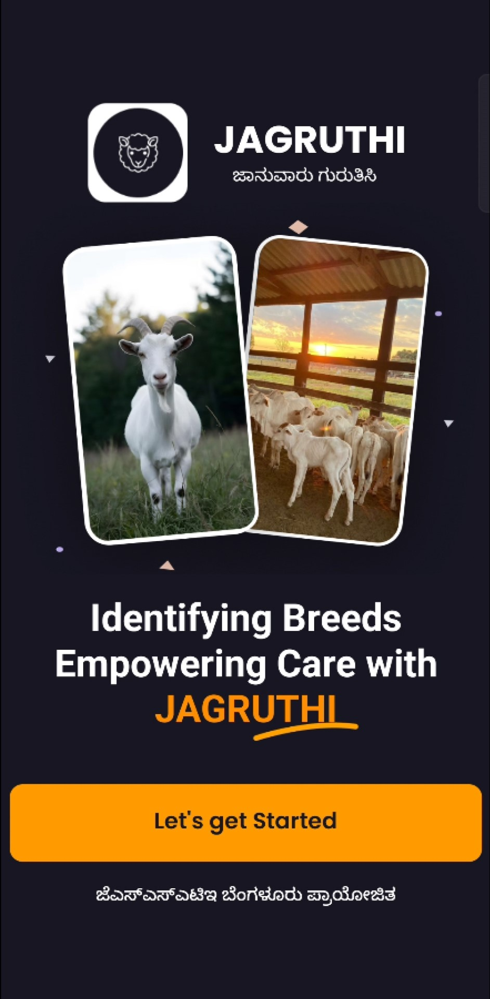
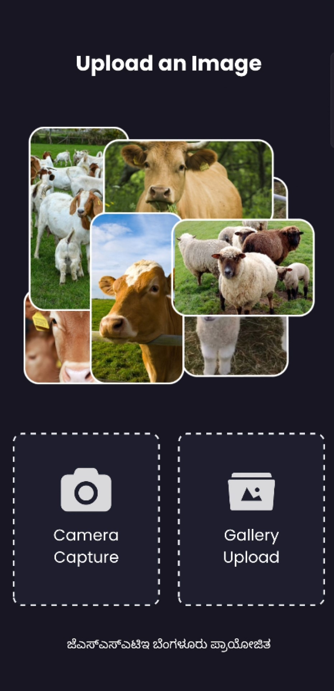
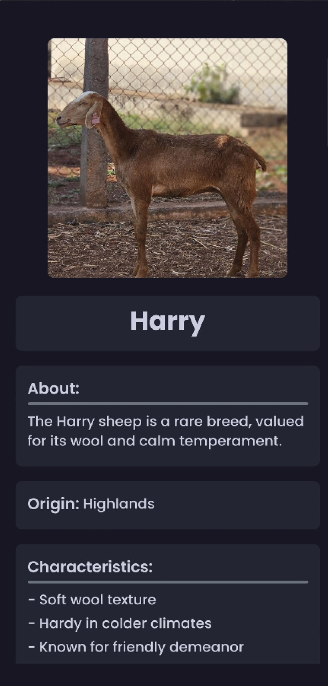
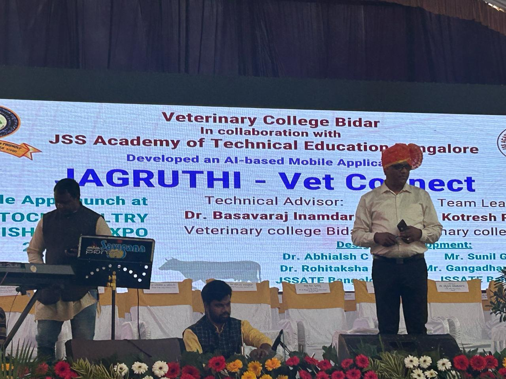

# 🐄 JAGRUTHI - Livestock Breed Identification App

**Empowering Farmers with AI-driven Breed Detection**

 <!-- Replace with actual image path -->

## 🚀 Overview

**JAGRUTHI** is an AI-powered mobile application built using **React Native** and **PyTorch** to accurately identify livestock breeds from images. The app is designed to assist farmers, veterinarians, and agricultural officers in recognizing various cattle and goat breeds, promoting better care and breeding strategies.

- 📱 **Cross-platform mobile app**
- 🧠 **EfficientNet-B2 based breed classification**
- ☁️ **Dockerized backend deployed on Google Cloud**
- 🤝 **Government-partnered initiative launched by the Agriculture Minister in Bidar**

---

## 🎯 Features

- 📷 **Upload or Capture Livestock Images**
- 🧬 **Accurate Breed Prediction (96.3% Accuracy)**
- 🌍 **Scalable & Reliable Deployment (99.9% Uptime)**
- 📊 **Breed Details & Characteristics Displayed**
- 🖼️ **Intuitive UI with Localization (Kannada Support)**

---

## 🛠️ Tech Stack

| Frontend        | Backend           | Model Training        | Infrastructure        |
|----------------|-------------------|------------------------|------------------------|
| React Native    | Node.js + Express | PyTorch + EfficientNet-B2 | Google Cloud Run + Docker |

---

## 🧠 Model Highlights

- 🏗️ **Architecture**: EfficientNet-B2 (pretrained)
- 🧪 **Accuracy**: 96.3% on real-world validation set
- 🗃️ **Classes**: Bidari, Deoni, Girr, Kenguri, Murra, Sirohi
- 📊 **Metrics**:
  - Precision: `X.XXX`
  - Recall: `X.XXX`
  - F1 Score: `X.XXX`

📁 [Model Training Code (Colab)](Model_Training.ipynb) | 📦 [Saved Model](model/effnetb2.pth)

---

## 📸 App Screenshots

| Home | Upload | Prediction |
|------|--------|------------|
|  |  |  |

---

## 🏛️ Government Partnership

> The app was proudly launched in **January 2025** in **Bidar**, Karnataka in partnership with the **Department of Agriculture**.

## 📬 Contact
If you'd like to collaborate, feel free to connect!

**Sunil Gopal C V**

